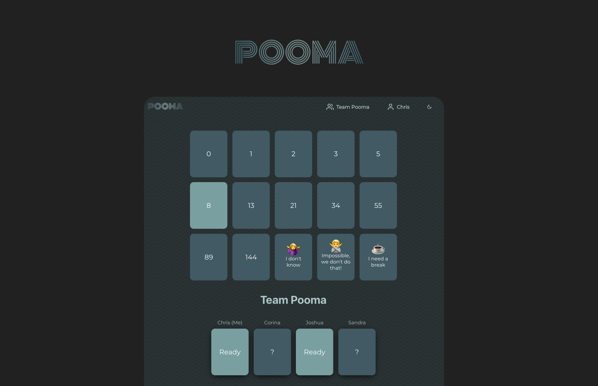

POOMA is a clean scrum poker web app built with Next.js, Supabase, and Chakra UI.

> POOMA stands for `pull out of my a**`

## Prerequisites

POOMA uses Supabase as realtime database. If you want to run it locally it's the easiest if you install the Supabase CLI. You can do this on project level or globally. See https://supabase.com/docs/guides/cli

Supabase provides you with a set of docker containers which can easily be started and connected to.

## Running locally

Clone this repo and change directory to the root of the repository.

```
git clone https://github.com/christianbueschi/pooma
cd pooma
```

Copy the sample .env file then open it and set the variables.

```
cp sample.env .env
```

Run Supabase

```
supabase start
```

Make sure to enable the realtime feature in the Supabase Studio. In order to do this

- Go to the table editor http://localhost:54323/project/default/editor
- Click on the arrow next to your table and click `Edit Table`
- Activate the checkbox `Enable Realtime`

The start command provides you with the `anon key`. Copy this key and paste it in your .env file. This key will not change after a shutdown (`supabase stop`) and restart of the containers. But if you shut down the containers they loose the Realtime setting.

Install dependencies

```
yarn
```

Start the Next.js server

```
yarn dev
```

## Running the tests

The project includes end-to-end tests that run using Playwright.

First you need to install playwright

```
npx playwright install
```

Run the tests

```
yarn test
```

If you want to see what it does in the browsers

```
yarn test:headed
```

## Built With

- [Next.js](https://nextjs.org/) - The react framework for the web
- [Supabase](https://supabase.com/) - Realtime Open Source Database on top of PostgreSQL
- [Chakra UI](https://chakra-ui.com/) - Simple and modular UI library

## License

This project is licensed under the MIT License - see the [LICENSE](LICENSE) file for details
